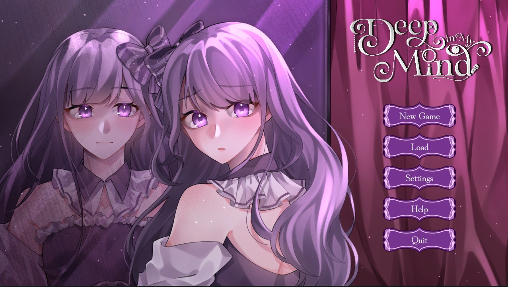
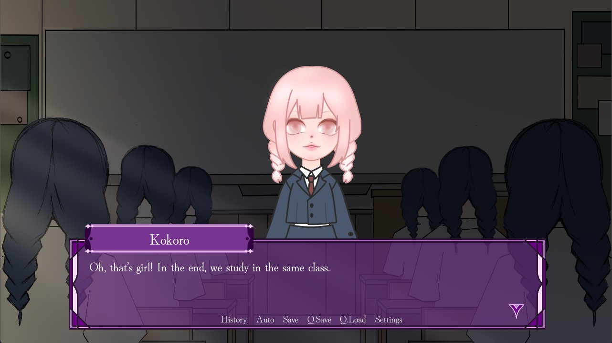
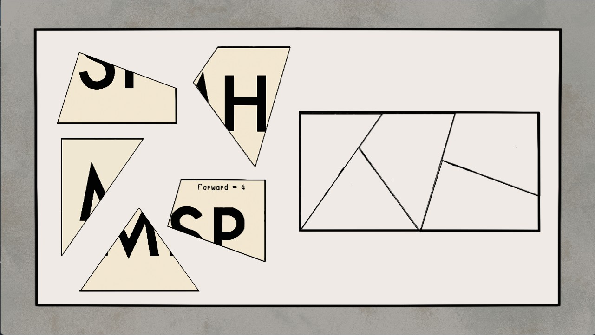
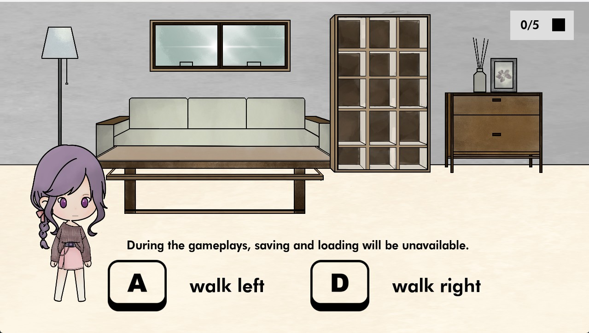
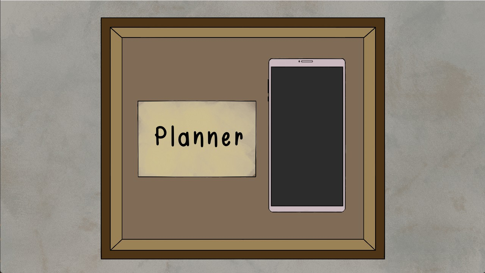
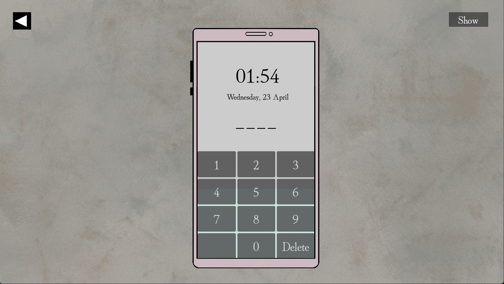
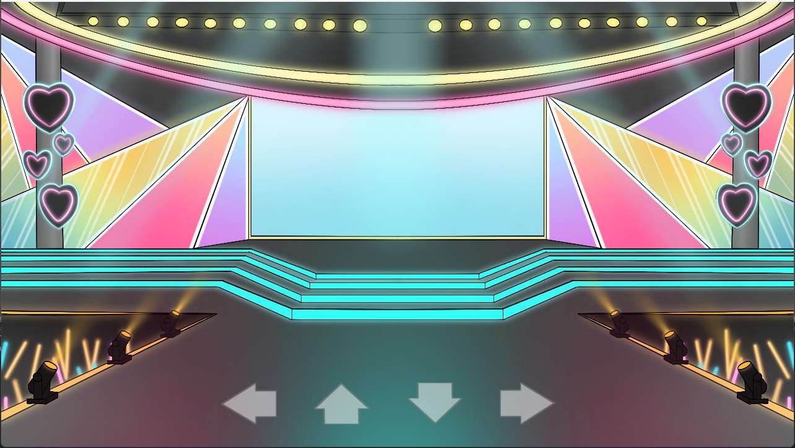

# Deep in My Mind

Deep in My Mind is a visual novel game by Godot in psychological horror genre. The story is about idol friends Kokoro and Kazumi. Kokoro learns that Kazumi has ended her own life. She does not believe or accept it. She has decided to investigate clues to reveal hidden secrets behind Kazumi's passing. While investigating, she discovers that mysterious secrets are deeper than she ever thought. 

## Installation
https://deepinmymind.itch.io/deepinmymind

## Game Features
### 1. Visual Novel Game
The visual novel game with simple functions, such as save, load, history, auto, settings, quick save, and quick load. (gui)

### 2. Drag and Drop Game
This game is about the papers to be dropped in the specified area. (drag_and_drop)

### 3. Parallax Gameplay
The player can interact with the objects and collect the papers throughout the dialogue. (parallax_gameplay)

### 4. Passcode Game
This game allows the player to guess the passcode to unlock the phone. (find_a_password)

### 5. Rhythm Game
This game is similar to the common piano game. (rhythm_game)

## Technologies
- Godot 4.2.2 - Game Engine
- Dialogic 2 Alpha 14.0 - Dialogue Library
- UniversalFade - Scene Transition Library
## Credits
Made by Busayawadee Suphap, Jidapa Punrod, and Nattarat Panjachaipornpol

 Our advisor: Dr.Pisit Praiwattana 

